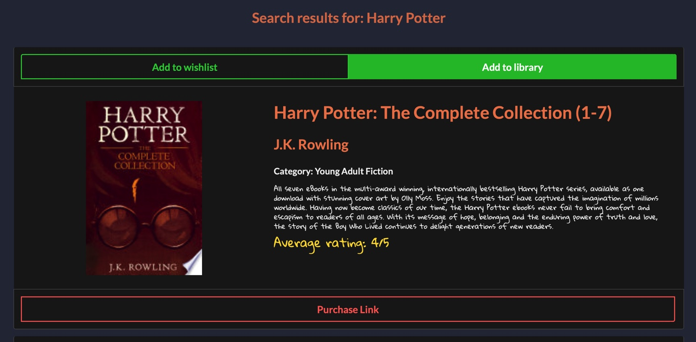
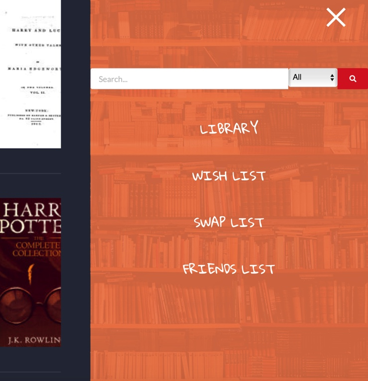
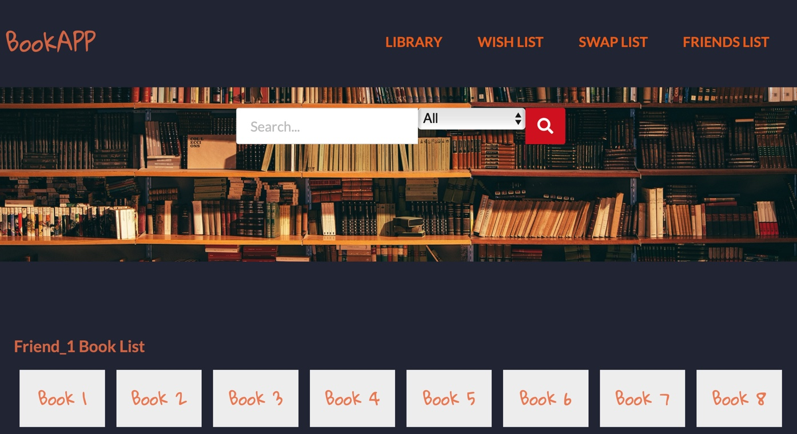

# BookApp


BookApp is an application which gives users the ability to create their own virtual book store using the old  books that they no longer need. The app incooperates a lot of features such as a dynamic navigation header, search bar and carousel which makes it very user friendly for all audiences. 


## How does the application work? 

 Follow the flow below to start swapping your old books and finding your new books. Find the site at https://wa20.github.io/BookApp/

1. The home page. Here you can search for a book that you would like to add to your wishlist or own library. The search capability is versatile as it allows users to search by author, book title, ISBN or catagory.


                            ↓
                            ↓

2. You will be presented with a list of all the relevant results, which are fetched from the 'GoogleBooks API' ( https://developers.google.com/books). As you can see below, every search result will give you the option of 'Add to Wishlist', 'Add to Library' and 'Purchase Link'. 


                            ↓
                            ↓

3. To view the books you have added to you Library or Wish list, you can navigate using the hyperlinks on the header or alternatively using the slide-out menu, which also adds to ease of use on mobile. 


                            ↓
                            ↓

4. Once you are happy with which books you have added to your Libary and Wish List, you can view them in the same page and naviagte through them quickly using the click and drag carousel feature. 


                            ↓
                            ↓

5. Finally to add your friends list of books that you would like to swap for, navigate to 'Friends List' where you will be given the option to enter your friends name and then their list of Books. 




## Technology Stack Used to Create BookApp

BookApp was created using purpose driven tech stack choices. All of the tools used contribute the elegant aesthetics, smooth interactability and efficiency. 

```
1. HTML 5
2. CSS3:
 Flexbox and Stylesheets inspired from;
- "https://cdnjs.cloudflare.com/ajax/libs/semantic-ui/2.4.1/semantic.min.css"
- "https://cdnjs.cloudflare.com/ajax/libs/font-awesome/5.15.2/css/all.min.css"\
- "https://unpkg.com/swiper/swiper-bundle.min.css"
3. JavaScript:
 JQUERY, AJAX libaries inspired from; 
 - "https://cdnjs.cloudflare.com/ajax/libs/jquery/2.2.2/jquery.min.js"
- "https://unpkg.com/swiper/swiper-bundle.min.js"
- "https://cdnjs.cloudflare.com/ajax/libs/semantic-ui/2.4.1/semantic.min.js"
```

## Contributors


* [@scottydocs](https://github.com/scottydocs) 📖
* [@cainwatson](https://github.com/cainwatson) 🐛
* [@calchuchesta](https://github.com/calchuchesta) 🐛
